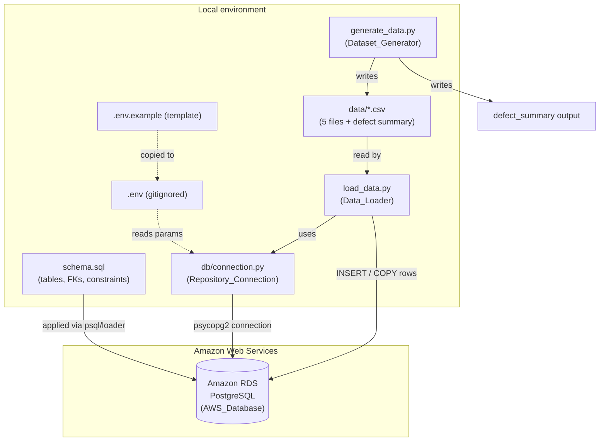

# Design Document

## Overview

This design describes an end-to-end e-commerce dataset project for a data analyst technical test. It extends an existing PostgreSQL schema, builds a deterministic Python/pandas data generator that injects controlled data-quality defects, exports the result as CSV, provisions a managed PostgreSQL database on Amazon RDS, connects the repository to that database through gitignored configuration, and loads the CSV data in a foreign-key-safe order with verification.

The project already contains two artifacts to build on:

- `schema.sql` — a PostgreSQL schema with five tables (`customers`, `categories`, `products`, `orders`, `order_details`) and four foreign keys, using `SERIAL` primary keys and `DECIMAL(12,2)` prices. It currently lacks the `NOT NULL`, `UNIQUE`, and `CHECK` constraints the refined requirements demand.
- `README.md` — documentation describing the intended workflow, referencing a `generate_data.py` script that must be created.

The design covers the following capabilities and maps them to requirements:

| Capability | Requirements |
| --- | --- |
| Relational schema with integrity constraints | 1 |
| Deterministic sample data at fixed volumes | 2 |
| Date distribution across last 12 months | 3 |
| Intentional data-quality defect injection | 4 |
| Historical price accuracy (unit_price snapshot) | 5 |
| CSV export to `data/` | 6 |
| AWS RDS PostgreSQL provisioning | 7 |
| Repository-to-database connection | 8 |
| FK-safe data loading with verification | 9 |
| End-to-end reproduction documentation | 10 |

**Out of scope:** analysis queries (`queries.sql`). The Analysis Queries requirement was intentionally removed. The README criterion (10.4) that references running queries is treated as a documentation placeholder; no analysis-query component is designed here.

**Design principles:**

- **Determinism first.** With a fixed seed, the generator produces byte-identical CSV output and identical defect placement across runs. Every random draw flows from a single seeded generator so ordering is stable.
- **Generate valid, then perturb.** The generator first builds a fully valid, referentially consistent dataset, then injects a bounded number of data-quality defects into nullable non-key columns only. This keeps foreign keys and primary keys always clean and makes defect counts easy to cap and audit.
- **Snapshot at generation time.** `order_details.unit_price` is copied from the product's `price` when the row is generated, so later price changes never mutate historical rows.
- **Credentials never in source.** Connection parameters live in a gitignored `.env`, with a committed `.env.example` template holding only placeholders.

## Architecture

The system is organized into five cooperating components: a schema definition, a data generator, a connection layer, a data loader, and provisioning documentation/infrastructure. The generator runs locally and produces CSV artifacts; the loader reads those artifacts and writes them to the RDS instance through the shared connection layer.



### Data flow

1. **Schema application.** `schema.sql` is applied to the RDS instance (via `psql` or a bootstrap step in the loader), creating the five tables, four foreign keys, and the refined `NOT NULL` / `UNIQUE` / `CHECK` constraints.
2. **Generation.** `generate_data.py` seeds a single RNG (`seed=42`), builds valid parent-then-child records (categories → customers → products → orders → order_details), snapshots `unit_price` from product `price`, injects bounded defects into nullable non-key columns, writes five CSVs to `data/`, and emits a defect summary.
3. **Connection.** `db/connection.py` reads parameters from `.env`, validates them, and opens a psycopg2 connection with a 10-second timeout.
4. **Loading.** `load_data.py` verifies all five CSVs exist, loads them in FK-safe order, maps empty cells to `NULL`, and verifies loaded row counts against the source files.

### Technology choices

- **Python 3.9+ / pandas** for generation and CSV I/O (already used by the existing script).
- **psycopg2-binary** for the PostgreSQL connection and loading (standard, well-maintained PostgreSQL driver).
- **python-dotenv** to read `.env` configuration without hardcoding values.
- **Amazon RDS for PostgreSQL** as the managed database host.
- **Hypothesis** as the property-based testing library for the generator logic.

## Components and Interfaces

### 1. Schema_Definition (`schema.sql`)

Extends the existing file. Additions required to satisfy Requirement 1:

- `NOT NULL` on mandatory columns per table (see Data Models).
- `UNIQUE` on `customers.email`.
- `CHECK (price >= 0)`, `CHECK (unit_price >= 0)`, `CHECK (quantity >= 0)`, `CHECK (stock >= 0)` to reject negative values (AC 1.12).
- `price` / `unit_price` remain `DECIMAL(12,2)` (AC 1.11).
- Existing four foreign keys retained (AC 1.7–1.10).

The schema stays declarative; it exposes no programmatic interface beyond being an applyable SQL file.

### 2. Dataset_Generator (`generate_data.py`)

Extends the existing script. Public entry point:

```python
def generate(seed: int = 42, output_dir: str = "data",
             generation_date: date | None = None) -> GenerationResult:
    """Generate the full dataset, write CSVs, return a result with the defect summary.
    Raises GenerationError on referential-integrity or price-resolution failure."""
```

Internal builders (each returns an in-memory table as a list of dicts / DataFrame):

- `build_categories(rng) -> categories` — exactly 4 rows (AC 2.2).
- `build_customers(rng, generation_date) -> customers` — exactly 30 rows, `registration_date` within last 365 days (AC 2.1, 3.1).
- `build_products(rng, categories) -> products` — exactly 15 rows, every category assigned ≥1 product, each product in exactly one category (AC 2.3, 2.6).
- `build_orders(rng, customers, generation_date) -> orders` — exactly 100 rows, each `order_date` on/after the referenced customer's `registration_date` and within the window, per-month distribution enforced (AC 2.4, 3.2–3.5).
- `build_order_details(rng, orders, products) -> order_details` — exactly 250 rows, `unit_price` snapshotted from product `price` (AC 2.5, 5.1–5.3).
- `inject_defects(rng, tables) -> DefectSummary` — inserts bounded defects into nullable non-key columns only (AC 4.1–4.7).
- `validate_referential_integrity(tables)` — raises `GenerationError` if any FK value has no parent (AC 2.8, 5.2).
- `write_csvs(tables, output_dir)` — writes five CSVs with headers, creating `data/` if absent (AC 6.1–6.6).

The order distribution algorithm (AC 3.3): allocate at least one order to each of the 12 calendar months in the window, then distribute the remaining 88 orders while enforcing a per-month cap of `floor(0.40 * 100) = 40`. Each order is then assigned a concrete day within its allotted month that also respects the referenced customer's registration date (AC 3.4–3.5); if the naive month/customer pairing has no valid day, the generator re-pairs the order with a customer whose registration allows a date in that month.

### 3. Repository_Connection (`db/connection.py`)

```python
REQUIRED_PARAMS = ["host", "port", "dbname", "user", "password"]

def load_config(env_path: str = ".env") -> ConnectionConfig:
    """Read and validate connection parameters. Raises ConfigError listing
    every missing/invalid parameter by name (AC 8.3)."""

def connect(config: ConnectionConfig, timeout_seconds: int = 10):
    """Open a psycopg2 connection with a 10s timeout. Raises ConnectionFailure
    with a cause on unreachable host or rejected auth (AC 8.4). Returns a
    connection whose state confirms queries can run (AC 8.2)."""
```

Configuration precedence: values come only from the `.env` file / environment (AC 8.1). A committed `.env.example` (AC 8.5) lists the five parameter names with placeholder values and no real credentials.

### 4. Data_Loader (`load_data.py`)

```python
LOAD_ORDER = ["categories", "customers", "products", "orders", "order_details"]

def load_all(conn, data_dir: str = "data") -> LoadReport:
    """Verify all five CSVs exist (AC 9.5), load in FK-safe order (AC 9.2),
    map empty cells to NULL (AC 9.3), verify row counts (AC 9.6). On FK
    violation, report table + row id and roll back that file (AC 9.4)."""
```

Each file is loaded inside its own transaction so a failure leaves that target table unchanged (no partial load). Empty CSV cells for nullable columns are converted to SQL `NULL` rather than empty strings.

### 5. Provisioning documentation & infrastructure (Requirement 7, 10)

Documentation (in `README.md` and a provisioning section) covers: the RDS instance identifier and engine version, the `publicly accessible` flag, the security-group inbound rule for the PostgreSQL port, credential storage outside source control, and the ordered commands to create the schema and load data. No live credentials are committed.

## Data Models

All tables use `SERIAL` primary keys. Types shown are PostgreSQL types.

### customers

| Column | Type | Constraints |
| --- | --- | --- |
| customer_id | SERIAL | PK, NOT NULL |
| first_name | VARCHAR(50) | NOT NULL |
| last_name | VARCHAR(50) | NOT NULL |
| email | VARCHAR(100) | NOT NULL, UNIQUE |
| city | VARCHAR(50) | nullable (defect target) |
| registration_date | DATE | within last 365 days |

### categories

| Column | Type | Constraints |
| --- | --- | --- |
| category_id | SERIAL | PK, NOT NULL |
| category_name | VARCHAR(50) | NOT NULL |

### products

| Column | Type | Constraints |
| --- | --- | --- |
| product_id | SERIAL | PK, NOT NULL |
| product_name | VARCHAR(100) | NOT NULL |
| category_id | INT | NOT NULL, FK → categories |
| price | DECIMAL(12,2) | NOT NULL, CHECK (price >= 0) |
| stock | INT | nullable, CHECK (stock >= 0) |

### orders

| Column | Type | Constraints |
| --- | --- | --- |
| order_id | SERIAL | PK, NOT NULL |
| customer_id | INT | NOT NULL, FK → customers |
| order_date | DATE | NOT NULL, within window, ≥ customer registration_date |
| status | VARCHAR(20) | nullable (defect target) |
| payment_method | VARCHAR(30) | nullable (defect target) |

### order_details

| Column | Type | Constraints |
| --- | --- | --- |
| order_detail_id | SERIAL | PK, NOT NULL |
| order_id | INT | NOT NULL, FK → orders |
| product_id | INT | NOT NULL, FK → products |
| quantity | INT | NOT NULL, CHECK (quantity >= 0) |
| unit_price | DECIMAL(12,2) | NOT NULL, CHECK (unit_price >= 0), snapshot of product price |

### Supporting in-memory models

```python
@dataclass
class DefectRecord:
    table: str          # e.g. "customers"
    column: str         # nullable non-key column
    row_id: int         # primary key of affected row
    defect_type: str    # "null" | "inconsistent"

@dataclass
class DefectSummary:
    records: list[DefectRecord]

@dataclass
class GenerationResult:
    tables: dict[str, "DataFrame"]
    defect_summary: DefectSummary
```

### Defect model

- **Nullable non-key columns eligible for defects:** `customers.city`, `orders.status`, `orders.payment_method`, `products.stock`.
- **Defect types:** a `null` defect sets the cell to NULL; an `inconsistent` defect writes a value deviating in format/unit/casing (e.g. mixed-case city `"bOgOtÁ"`, or an email in a different format when applied to a nullable string field).
- **Cap:** per table, at most `floor(0.10 * row_count)` defects; overall at least 1 (AC 4.1, 4.4).
- **Exclusions:** never in PK or FK columns (AC 4.5).
- **Determinism:** with a fixed seed, defect columns, rows, and values are identical across runs (AC 4.7).

## Correctness Properties

*A property is a characteristic or behavior that should hold true across all valid executions of a system — essentially, a formal statement about what the system should do. Properties serve as the bridge between human-readable specifications and machine-verifiable correctness guarantees.*

The dataset generator is a strong fit for property-based testing: it is pure, seeded logic with universal invariants over structure, dates, defects, and prices. The properties below are derived from the prework analysis, with redundant criteria consolidated. Schema constraint behavior, connection validation, and loader transformation logic contribute a few additional properties; AWS provisioning, connection I/O, and documentation are covered by integration/smoke tests instead (see Testing Strategy).

### Property 1: Structural volumes, key integrity, and category coverage

*For any* seed, the generated dataset SHALL contain exactly 30 customers, 4 categories, 15 products, 100 orders, and 250 order_details; all primary keys within each table SHALL be unique; every foreign key value (product→category, order→customer, order_detail→order, order_detail→product) SHALL reference an existing parent row; each product SHALL belong to exactly one category; and each of the 4 categories SHALL have at least one product.

**Validates: Requirements 2.1, 2.2, 2.3, 2.4, 2.5, 2.6**

### Property 2: Deterministic, byte-identical output

*For any* fixed seed, generating the dataset twice SHALL produce identical tables and byte-identical CSV files, including identical data-quality defect columns, rows, and values.

**Validates: Requirements 2.7, 4.7**

### Property 3: Dates within the last 12 months

*For any* seed and generation date, every customer `registration_date` and every order `order_date` SHALL fall within the inclusive window [generation_date − 365 days, generation_date].

**Validates: Requirements 2.9, 3.1, 3.2**

### Property 4: Monthly order distribution

*For any* seed, when the 100 orders are grouped by calendar month across the 12-month window, every one of the 12 months SHALL contain at least one order and no single month SHALL contain more than 40 orders.

**Validates: Requirements 3.3**

### Property 5: Orders dated on or after customer registration

*For any* seed, for every order, its `order_date` SHALL be on or after the referenced customer's `registration_date` and on or before the generation date.

**Validates: Requirements 3.4, 3.5**

### Property 6: Data-quality defects are bounded

*For any* seed, the total number of injected defects SHALL be at least 1, and the number of defects in any single table SHALL be at most floor(0.10 × that table's row count).

**Validates: Requirements 4.1, 4.4**

### Property 7: Required defect types are present

*For any* seed, the injected defects SHALL include at least one NULL value in a nullable non-key column and at least one inconsistent value (deviating in format, unit, or casing).

**Validates: Requirements 4.2, 4.3**

### Property 8: Defects never touch key columns

*For any* seed, no injected defect SHALL target a primary key or foreign key column, and after injection every primary key and foreign key value SHALL remain valid and referentially intact.

**Validates: Requirements 4.5**

### Property 9: Defect summary completeness

*For any* seed, the set of cells actually altered by defect injection SHALL exactly equal the set described by the defect summary, and each summary entry SHALL identify a valid table, column, row identifier, and defect type.

**Validates: Requirements 4.6**

### Property 10: unit_price snapshots product price

*For any* seed, every order_detail's `unit_price` SHALL equal the `price` of its referenced product at generation time, expressed with a scale of exactly 2 decimal places.

**Validates: Requirements 5.1**

### Property 11: Snapshot price immutability

*For any* seed, after order_details are generated, changing a product's `price` SHALL leave the `unit_price` of previously generated order_details unchanged.

**Validates: Requirements 5.3**

### Property 12: CSV write/read round-trip

*For any* seed, writing a generated table to CSV and reading it back SHALL reproduce the same table content, and each CSV's header row SHALL contain exactly the corresponding table's column names.

**Validates: Requirements 6.3**

### Property 13: Schema rejects negative numeric values

*For any* negative value inserted into `price`, `unit_price`, `quantity`, or `stock`, the applied schema SHALL reject the row via a constraint violation and leave existing table contents unchanged.

**Validates: Requirements 1.12**

### Property 14: Connection parameter validation names every bad parameter

*For any* subset of the five required connection parameters (host, port, dbname, user, password) that is missing or invalid, configuration loading SHALL fail without opening a connection and SHALL return an error naming exactly those missing or invalid parameters.

**Validates: Requirements 8.3**

### Property 15: Empty CSV cells load as NULL

*For any* CSV row containing empty cells in nullable columns, the loader SHALL insert SQL NULL for those cells rather than an empty string.

**Validates: Requirements 9.3**

### Property 16: Load row-count conservation

*For any* generated dataset, after loading completes, each table's loaded row count SHALL equal the number of data rows in its source CSV file.

**Validates: Requirements 9.6**

## Error Handling

| Condition | Component | Behavior | Requirement |
| --- | --- | --- | --- |
| Generated FK value has no parent | Generator | Raise `GenerationError` naming the violation; write no CSV files | 2.8 |
| order_detail references missing/price-less product | Generator | Reject the row, exclude it, raise error identifying the unresolved product; leave prior rows unchanged | 5.2 |
| A CSV file cannot be written | Generator | Raise an error identifying the specific file | 6.6 |
| Schema application fails on a statement | Provisioning | Report the failing statement; leave no partially applied objects from the failed run | 7.3 |
| Missing/invalid connection params | Connection | Raise `ConfigError` listing each bad parameter by name; do not connect | 8.3 |
| Host unreachable or auth rejected | Connection | Raise `ConnectionFailure` with cause; enforce 10s timeout | 8.4 |
| FK violation during load | Loader | Report violating table + row id; roll back the file's transaction (no partial load) | 9.4 |
| Missing source CSV | Loader | Report the missing file; do not begin loading any file | 9.5 |
| Row-count mismatch after load | Loader | Report the mismatch per table | 9.6 |

**Transaction strategy:** each CSV is loaded within its own transaction, so a mid-file failure rolls back that file's inserts entirely, satisfying the "no partial load" requirements (9.4). Generation validates referential integrity fully in memory before any file is written, so a validation failure produces zero output (2.8).

**Credential safety:** connection errors and logs reference parameters by name (e.g. "password missing") and never echo secret values.

## Testing Strategy

### Property-based tests (generator, schema constraints, connection validation, loader logic)

- **Library:** Hypothesis (Python). Property implementations SHALL NOT be hand-rolled random loops.
- **Iterations:** each property test runs a minimum of 100 examples.
- **Seeds as inputs:** most generator properties quantify over the RNG seed (Hypothesis `integers`), so a wide range of seeds is exercised; the determinism property (Property 2) also fixes a seed and compares two runs.
- **Tagging:** each property test carries a comment tag in the format **Feature: ecommerce-database-aws, Property {number}: {property_text}** referencing the design property above.
- **Coverage:** Properties 1–12 target the generator; Property 13 targets the applied schema constraints (run against a local/ephemeral PostgreSQL such as a test container, or a validation model); Property 14 targets connection-parameter validation; Properties 15–16 target loader transformation and conservation logic (using an in-memory/SQLite-style or mocked cursor for the transformation-level checks and a test PostgreSQL for conservation).

### Example-based unit tests

Cover specific scenarios and error conditions that are not universal properties:

- Referential-integrity failure aborts generation with no output (2.8).
- Unresolvable/price-less product rejection without altering prior rows (5.2).
- Late registrant (registration_date == generation_date) still receives a valid order date (3.5 edge case).
- Five CSVs exist with correct names in `data/` after a run (6.1, 6.2).
- `data/` is created when absent (6.4); stale files are overwritten on re-run (6.5).
- Write-failure error names the file (6.6).
- `.env.example` lists the five parameter names with placeholders and no secrets (8.5); `load_config` reads from `.env` (8.1).
- Unreachable host / bad auth fails with a cause under 10s (8.4).
- `LOAD_ORDER` places parents before children (9.2).
- FK violation during load reports table + row id and leaves the table unchanged (9.4).
- Missing source file reported before any loading begins (9.5).

### Integration tests (AWS RDS)

Run with 1–3 representative examples, not property iterations, because they exercise external infrastructure whose behavior does not vary with input:

- RDS PostgreSQL instance reaches "available" and accepts a connection on its port (7.1).
- Applied schema contains exactly the five tables and four foreign keys (7.2).
- Valid parameters connect within 10 seconds and can run `SELECT 1` (8.2).
- End-to-end: generate → load → confirm all five tables populated with matching row counts (9.1).

### Smoke / review checks

- Schema catalog inspection confirms columns, types, NOT NULL, UNIQUE(email), and FKs (1.1–1.11).
- Provisioning documentation completeness checklist (7.4, 10.1–10.6).
- `.env` is gitignored and no credential values appear in tracked files (7.5).

### Why property-based testing applies here

The dataset generator is pure, seeded logic with clear input/output behavior and rich universal invariants (fixed counts, date windows, distribution bounds, defect caps, price snapshots, round-trips) — the core case where PBT delivers value. The schema-constraint, connection-validation, and loader-transformation properties also express genuine "for all inputs" statements. In contrast, AWS RDS provisioning, live connection establishment, and documentation are infrastructure/IO/prose concerns with no meaningful input variation, so they are covered by integration and smoke tests rather than property tests.
